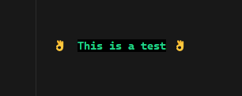

# LogPainter 🚀


logpainter is a lightweight and easy-to-use package for adding **stylized console messages** and **animated loaders** in Node.js.

## Installation 📦

```sh
npm install logpainter
```

or for development

```sh
npm install logpainter --save-dev
```

---

## Usage 🛠️

### `consoleStyler` – Styled Console Messages 🎨

Use `consoleStyler` to display formatted messages in the terminal with colors, emojis, and text styles.

```ts
import { consoleStyler } from 'logpainter'

consoleStyler('This is a test', {
  color: 'green',
  emojiStart: 'ok_hand',
  bgColor: 'black',
  bold: true,
  emojiEnd: 'ok_hand'
})
```

**Example Output:**



---

### `consoleLoader` – Animated Terminal Loaders ⏳

Use `consoleLoader` to display a loading animation while executing an asynchronous task.

```ts
import { consoleLoader } from 'logpainter'

consoleLoader(asyncFuntion, {
  message: 'Making a request...',
  color: 'green',
  emojiStart: 'hourglass_not_done',
  bgColor: 'black',
  bold: true,
  emojiEnd: 'hourglass_done',
  loaderName: 'soccer'
})
  .then((res) => {
    const asyncFuntionRes = res
    consoleStyler('Success!', {
      color: 'green',
      emojiStart: 'check_mark_button'
    })
  })
  .catch((err) =>
    consoleStyler('Failed!', {
      color: 'red',
      emojiStart: 'cross_mark'
    })
  )
```

**Example Output:**

<!-- Add a GIF showcasing consoleLoader here -->


---

## Available Options ⚙️

### `consoleStyler` Options:

| Option       | Type      | Description                                  |
| ------------ | --------- | -------------------------------------------- |
| `color`      | `string`  | Text color (`red`, `blue`, `green`, etc.).   |
| `bold`       | `boolean` | Bold text.                                   |
| `bgColor`    | `string`  | Background color.                            |
| `indent`     | `number`  | Spaces before the text.                      |
| `emojiStart` | `string`  | Emoji at the beginning.                      |
| `emojiEnd`   | `string`  | Emoji at the end.                            |
| `aling`      | `string`  | Text alingnment (`left`, `center`, `right`). |

---

### `consoleLoader` Options _(extends `consoleStyler` options)_

`consoleLoader` includes all options from `consoleStyler`, plus the following:

| Option       | Type     | Description                                      |
| ------------ | -------- | ------------------------------------------------ |
| `message`    | `string` | Loading message.                                 |
| `loaderName` | `string` | Loader animation style (`arrows`, `dots`, etc.). |

---

## TypeScript Support 🟦

LogPainter provides full TypeScript support. You can import types like this:

```ts
import type { ConsoleLoader, ConsoleStyler } from 'logpainter'
```

---

## License 📜

MIT License © 2025 [ChifoDev](https://github.com/Federico-Pena)
